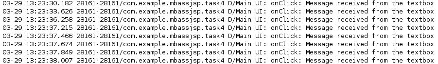
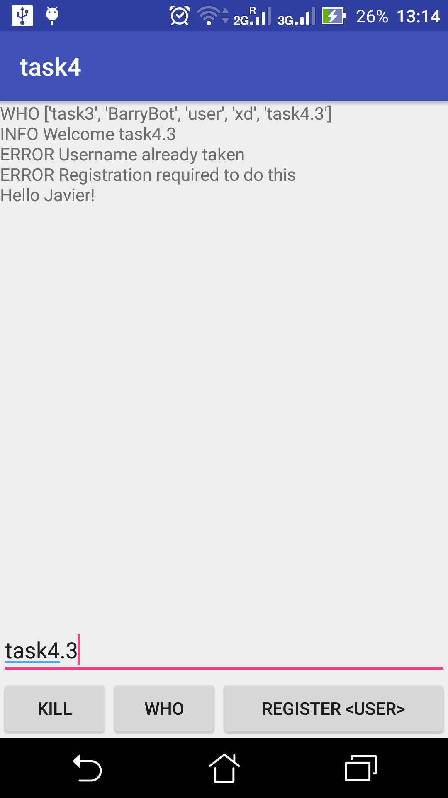
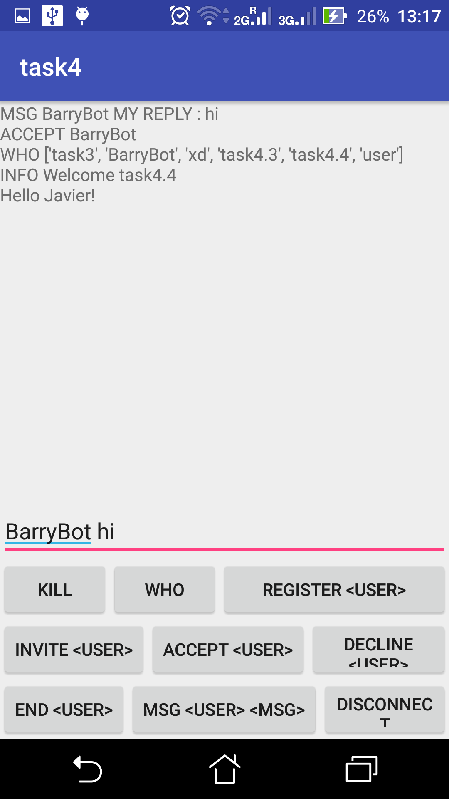
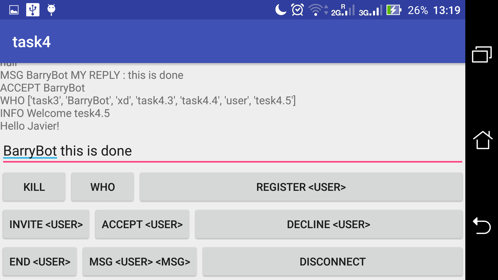

 # COMP28512 - Mobile Systems
## Exercise 4 - Messaging with Android Smartphones
> Mar 2019
> 
> Javier Pacheco Rodriguez

- - -

### Part 4.1 [4 marks]
In  this part we do not use an android device to provide interaction with a  server just yet. Instead we run the proxy server provided and interact  with a `BarryBot.py` socket using a separate telnet connection. All `BarryBot` does is send back the same message it has received as so to acknowledge that the message has been received.

#### 1. Are you satisfied that the two Python programs `server.py` and `BarryBot.py` will allow you to test a simple messaging system developed in Android?
Assuming  that the Android application will have the same effect as interacting  with the two programs from a telnet terminal, then yes. I think this  because BarryBot  seems reliable enough to always connect itself and reply to our  messages so if we want to test if our messages are getting somewhere and  can go back from that somewhere, to where we started. With this I mean  that BarryBot  is not going to help us know if our messages are only arriving at their  destination solely, but also if the connection is set up so that the  messages can go back to us as well. If we only wanted to test one of  these two behaviours separately, then BarryBot wouldn't help us, but we want to test both so it is usefult and I'm satisfied with its interactions as, once again, it seems to always be reliable.

#### 2. If `BarryBot`  were a real user, how would he know when the TELNET client has  terminated your connection to him? How could the protocol be improved in  this respect?
As far as I'm concerned, in the more recent apps for  messaging, bots exist in a way that does not require to be constantly  polling the server to see if they have any user to respond to. They way  it is set up is that the server is the one in charge of telling the bot  that there may or may not be messages that await its response. The way  this laboratory is set up is by a peer-to-peer communication, so the  server doesn't take part in the communication at all after it's been set  up. This is how the protocol could be improved, having the server  telling the bot when there are news in the form of messages to respond  to and users to interact with. If no users, then the bot will stay  sleeping, so the server would manage their more efficient functionality.

In  terms of knowing when the user has left the conversation, our protocol  currently supports the who command, which tells us what users are  currently connected to it. BarryBot  could check that the user is still there (hasn't left) by checking that  their name is still in the output of the who command every once in a  while. When the user is no longer connected then the connection can be  closed.

#### 3. Why are literal strings discouraged in Android? What is the preferred alternative?
Having  literal strings appearing in all places of the code makes it hard to  know where they are created, or create a lot of redundancy if we are  using the same one multiple times. Moreover, it makes it difficult to  translate these efficiently, as one would have to change them everywhere  in the code and produce a new version of the app in a different  language, which is tedious and definitely not maintainable.

Instead,  they are considered a resource of the app, and they themselves get  stored in the res directory with references to them from the rest of the  code that uses them.

#### 4. What is the purpose of the following files and directories created by Gradle?
  * `src/main/java`:  This is where the java classes are kept. They provide the knowledge and  the programmable design of the app to make it function. In this lab it  contains the three threads for UI, connection & receiver and transmitter.
  * `src/main/res/`: Is intended to contain the more *static* resources of the application, such as the graphics, layout, strings, etcetera.
  * `src/main/AndroidManifest.xml`: This is where the Android version, and some useful metadata about the app is contained. It is then read and processed by GooglePlay, for example, to check that users will be able to run it before having to install it.

#### 5. How does the naming of a package affect the file structure of an Android project?
The  packages are what identify the application. They are objects that  contain all the information and specification of the app and that can be  used by the package installer to then install the package into a  device. Plus, as everything is self contained whithin  its package, it is easy to organise the structure of the app and keep  the tests in one place and the code in another, for example. For  instance, these test directories will preserve the naming of the package  but have appended the keyword *test* at the end.

### Part 4.2 [4 marks]
In this part we modify the behaviour of the `Send` button to transmit to the server a `REGISTER myname` command. The `Kill` button is intended to close the app.


#### 1. Where did you store your fixed text message?
The string of text is stored into the transmiterText  variable. However, it is in itself a reference to a string located in  the `res` directory to enable, as I mentioned earlier, translations and  all being in one place.

#### 2. How did you check that the ‘btnSendCmd’ and ‘btnKill’ buttons had the desired effect?
Checking  that they were being mapped correctly to the button objects of the app  layout was done using the Log capabilities of Android Studio. If they  were then the code inside would run which makes a new logcat  entry to be created with the tag that I've specified. It's behaviour is  then compared to what I expect: Kill, to terminate the app; Send to  communicate to the server. Also, the reply to the server is analysed to  see that, because we are using the same hard-coded username, we are not able to register more than once with it.

#### 3. Explain how you used the logcat debugging facility and show an example of the output obtained (in your demo and your report).
As  I said above, the body of the button methods should be run if they are  correctly mapped to the layout objects. When they are pressed, that's  what the `onClick` means, its body will run. Inside this body code there a statement which creates a new logcat entry:
```java
Log.d(TAG, msg: "Send button has been pressed. REGISTER command sent.");
```
Android Studio displays information regarding the logcat in a window that then separates the different debugging levels. The logcat entries are displayed there and include the timestamp, and the message, with other bits of information.
```
2019-03-29 03:57:45.612 27256-27256/com.example.mbassjsp.task4 D/MainActivity 1: Send button has been pressed. REGISTER command sent.
```

#### 4. How does the ‘runOnUiThread’ method deal with inter-thread communications in Android?
Calling the `runOnUiThread` method will instantiate a new runnable object to be added to the execution queue which then gets executed by the thread.

#### 5. Why is ‘runOnUiThread’ needed for the NetworkConnectionAndReceiver thread but not for the Transmitter thread?
Because the `NetworkConnectionAndReceiver` thread is always being attached to the main UI thread, whereas the Transmitter thread is only active whenever there is something to transmit.

### Part 4.3 [4 marks]
In this part we enable to user to input their own text into a textbox field within the app and provide a title.


#### 1. How is your screen layout (however simple) made suitable for the application as developed so far?
Top-to-bottom there is a title, a log of the server messages, a textbox and buttons to kill the application, register the entered username or see who is online. It all fits in one screen and is simple.

#### 2. What happens if the proxy-server is not on-line?
The  only interactions the user could make would be to kill the application  and see that the register or who commands aren't producing any change,  that is, don't work.

#### 3. What happens if you try to register with a name that is already in use?
When the server is running we get an error saying that you (meaning this username) have already been registered with the server.

#### 4. Could anything else go wrong with this preliminary version of the app?
Firstly, the user is not able to find out who is online before registering with the server. Secondly, after closing the app and opening it again, you'd  have to choose a different username, thus a username  lasts only for the duration of the app running. And finally, not the  whole set of commands is set up, so the user cannot have interactions  with anyone just yet.
Also, as there is no invite option, users can still not interact as the proxy enforces that they have a connection set up, which they don't.

### Part 4.4 [4 marks]


#### 1. What are the main features of your new layout and how do they work?
The three previous buttons have been extended into six: Kill, register, who, accept, invite and msg.
These new buttons have been mapped to the server in order to fetch the content from the textbox  and send it to the server with the right command appended to it. There  is no input validation up to this point so the errors are returned after  having established a communication with the server and it sending them  back.

#### 2. What are the possible disadvantages of using the  proxy-server’s MSG command to convey the communications to and from  clients, especially if you are thinking about introducing spoken  messages and multimedia?
A message really should be split into packages when it becomes long enough. The current proxy server does not  account for this as these packages would be understood as different  messages, not parts of a single one. Having something like this would  enable an easy way of sending audio and media through the same msg  command. However this approach would still be rather incorrect as  messaging is commonly referred to as sending string of text between  users and not pieces of music or images, even though these can  ultimately be represented as such.

Plus, the msg  command requires both users to be online at the same instant, thus  sending a large chunk of data would require them both to stay connected  for the entire duration of the transmission of that data to ensure it  arrives correctly. Otherwise parts of it would be chopped out.

Furthermore, the question is stating that the users will use the proxy server to interact with each other, while in reality this should be done with a connection that the server sets up.

### Part 4.5 [4 marks]


#### 1. What are your improvements?
Because  it doesn't make sense to have all buttons available on the screen at  all times, as you can't even use some of them before registering or  before having a user to interact with, they should be displayed only  when they can be used. I've achieved this by making the buttons be faded  in black when the user should not interact with them. Even if they try,  they appear o not do anything.

Also, displaying the most recent  message in bold or using a larger font would make the user experience  better. So would removing all the log from the server from the screen  and only keeping the most recent bits of information.
The app can't  be rotated but perhaps there is need of implementing it on a landscaped  screen (on a car, even though the nature of the app doesn't fit a  driving environment) so improvement for this and the buttons to be  reordered should be taken into account.

#### 2. Are there any deficiencies in the protocol as currently implemented by the proxy-server?
The  current server doesn't inform a user that is currently messaging  another user that they have left the conversation or that they have been  disconnected. This should be taken care of by the server, and it wouldn't be hard to support this.

Also, more private messaging and chat rooms would be an additional extension to the app.

#### 3. How could the proxy-server be improved?
As  I've just mentioned, chat rooms and private messaging (with a strong  although slower encryption) would be an ideal implementation.

Also,  the server could be able to store communication requests and messages of  users even when they aren't both online at the same time, so that they  get notified whenever they come back online that some user has sent them  a message request or a message. Obviously, these messages should be  able to be sent to the destination user then.
